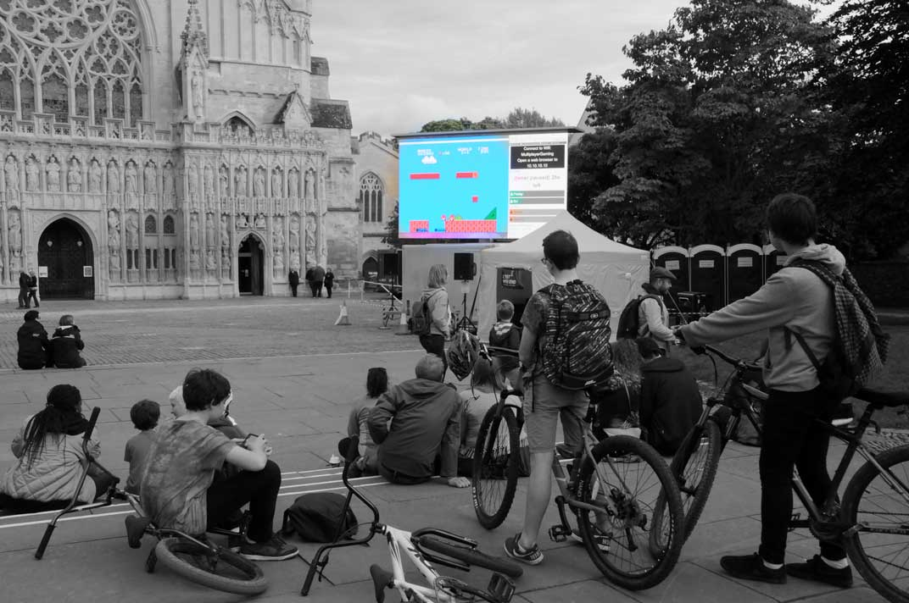
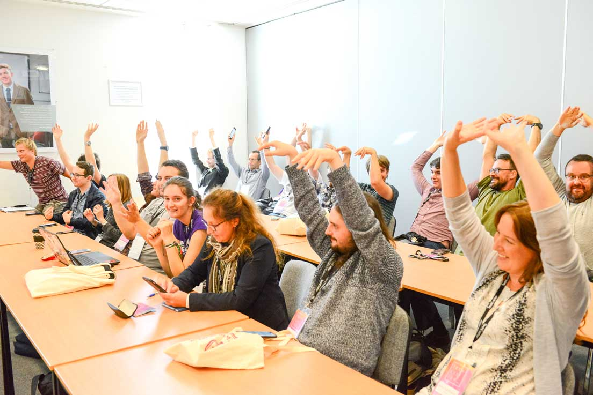
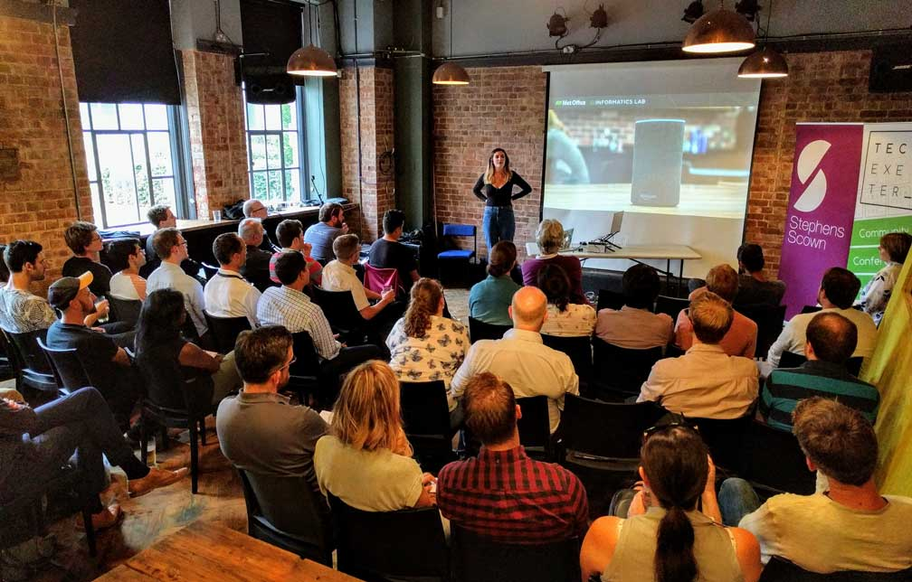

<!-- Main -->

<!-- One -->
<section id="banner">
	<!-- Content -->
	

	
	<blockquote><strong>GAME>PLAY</strong> is a Exeter's biggest gaming festival - bringing together playable art, retro gaming, indie games and  shows together for one jam-packed weekend.</blockquote>
	

</section>

<!-- Two -->
<section id="two" class="spotlights">
	<section>
		<i class="image">
		
		</i>
		

			

				<header class="major smallmargin">
					<h3>We think Exeter needs to <em>play</em> more!</h3>
				</header>
			
We've got some amazing play/gaming centres in Exeter - escape rooms, board game cafés, tabletop boardgaming shops, and a games development course at Exeter College - so we thought it would be a good idea to bring together everyone for a festival of playability!

			

		

	</section>
	<section>
		<i class="image">
			
		</i>
		

			

				<header class="major smallmargin">
					<h3>GAME>PLAY 2020</h3>
				</header>
				
Last year's one-day festival was so much fun we had to bring it back - so we've partnered with Exeter City Council to run it alongside Exeter Festival! We've got plenty on, but are always up for more - more art, more interactive workshops and more games! So if you enjoy what we've done this year, we'd love to hear your thoughts on how to make the event better for next year.

				

			

		

	</section>
		<section>
		<i class="image">
			
		</i>
		

			

				<header class="major smallmargin">
					<h3>TechExeter</h3>
				</header>
				
This event has been curated by Kris Sum of TechExeter CIC - a non-profit community interest company. With over 1000+ members on <a href="https://meetup.com/techexeter/" target="_blank">meetup.com</a>, dozens of free events every year, plus the annual tech conference, TechExeter is at the heart of the local tech community.

			

		

	</section>
</section>

