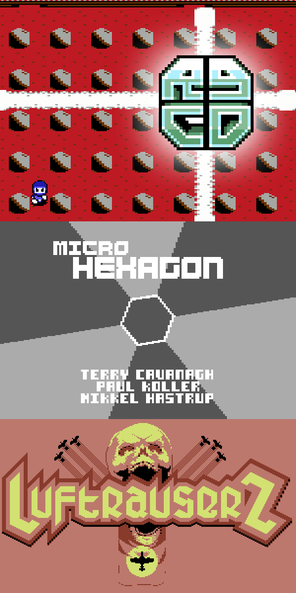

<!-- Main -->

<section id="one">
	

	
Location: MAKETANK, Paris Street

	
Our indie games expo showcases the latest and greatest games that you may have never heard of! Please note: children under the age of 12 must be accompanied by an adult.

	
<strong>Opening Times</strong>

	<ul>
	<li>Sat 4th July: 10am - 8pm</li>
	<li>Sun 5th July: 10am - 6pm</li>
	</ul>
	

</section>

<!-- Two -->
<section id="two" class="spotlights">
		<section>
			<i class="image">
			
			</i>
			

			

				<header class="major smallmargin">
					<h3>Retro Gamer CD's C64 Showcase</h3>
				</header>
				

				The classic 8-Bit Commodore 64 has been around for over 30 years, and Exeter-based RGCD are one of the few teams in the world developing, publishing and selling new games for for the system. Probably best known for their official Commodore 64 cartridge releases such as LuftrauserZ, Super Bread Box, Micro Hexagon and C64anabalt, in total RGCD have launched over 30 games for the little 8-bit bread-bin (as well as other platforms).

				

				RGCD will be showcasing some of their latest releases on real Commodore hardware, including upcoming releases for the Amiga in 2019.
				

				
				<ul class="actions">
					<li><a href="https://www.rgcd.co.uk/p/games.html" class="button small" target="_blank">Learn more</a></li>
				</ul>
			

		

	</section>

	<section>
		<i class="image">
		
		</i>
		

		

			<header class="major smallmargin">
				<h3>Tap Happy Sabotage</h3>
			</header>
			
A frantic party game by Alistair Aitcheson for as many players as can fit around one giant touchscreen!

			
Divided into a series of fast-and-furious minigames, each round gives the player a new way to move around the screen, a new excuse to get in each other's way and a new way to cheat and sabotage each other!

			<ul class="actions">
				<li><a href="https://www.youtube.com/watch?v=Fd3GZvUWTiE" class="button small" target="_blank">Watch on YouTube</a></li>
			</ul>
		

		

	</section>

</section>

