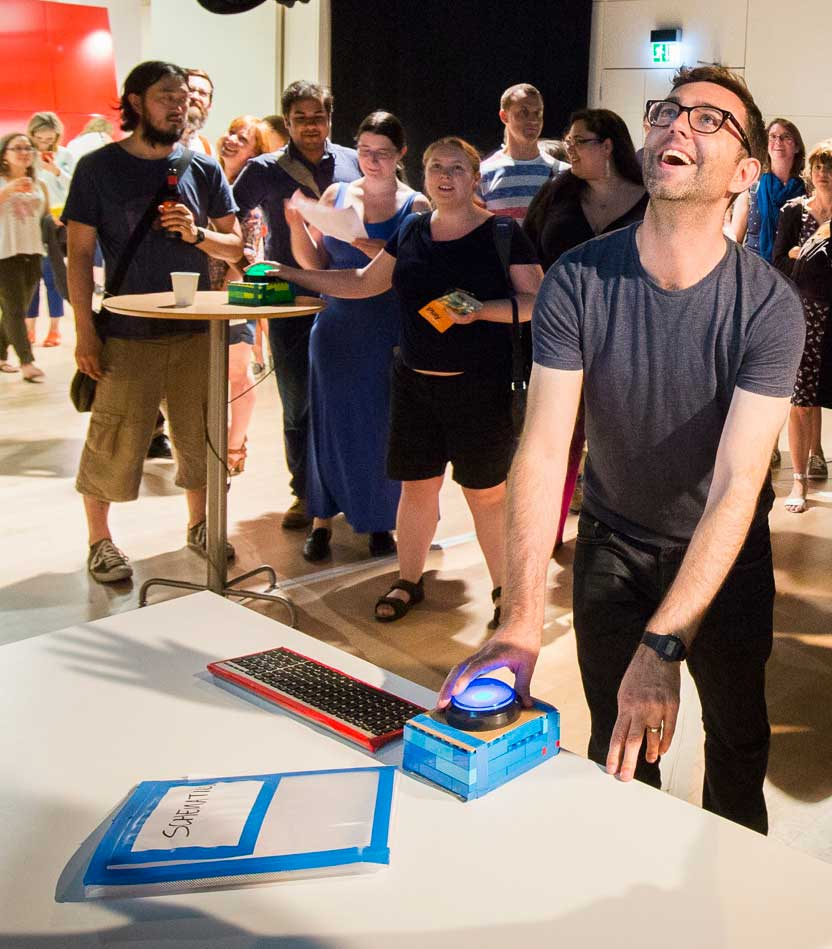

<!-- Main -->

<!-- Two -->
<section id="two" class="spotlights">
	<section>
		<i class="image">
		
		</i>
		

			

				<header class="major smallmargin">
					<h3>Codex Bash</h3>
				</header>
				
Location: 1st Floor / Meeting Room

				
A game installation designed by Alistair Aitcheson to mix physical movement with teamwork, communication and problem-solving.

				
One physical space, four big buttons and codes to be cracked! Players must use clues scattered around the room to uncover a sequence of button presses, and run around to bash the buttons in the right order.

				
You may have to flip through maps, pick apart circuit diagrams or rifle through a book of spy photos, but one thing’s for certain: the best codebreakers work as a team!

				<ul class="actions">
					<li><a href="https://www.youtube.com/watch?v=evFruZO9YM4" class="button small" target="_blank">Watch on YouTube</a></li>
				</ul>
				
			

		

	</section>
	
</section>

