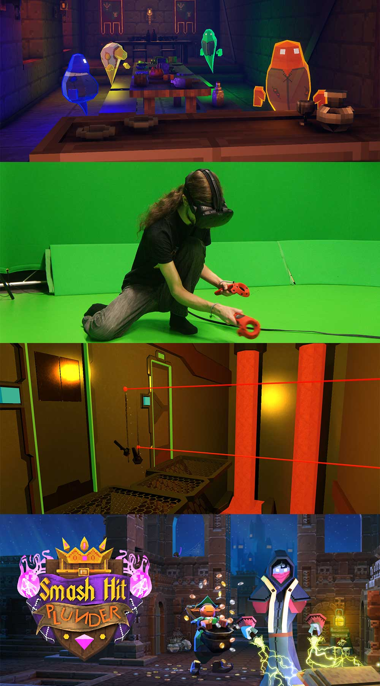

<!-- Main -->

<section id="one">
	

	
Location: SQUARE (between Café Rouge and Coal), Princesshay Shopping Centre

	
Our indie games expo showcases the latest and greatest games that you may have never heard of! Please note: children under the age of 12 must be accompanied by an adult.

	

</section>

<!-- Two -->
<section id="two" class="spotlights">

	<section>
		<i class="image">
		
		</i>
		

			

				<header class="major smallmargin">
					<h3>Triangular Pixels' VR Expo</h3>
				</header>
				
Location: Workshop

				
Triangular Pixels are award winning Cornish indie games developers, with a passion for fun, light hearted, and manic local multiplayer gaming. They're bringing their latest games for you to have an exclusive play on!

				
				<h3 style="margin:0px;">Unseen Diplomacy, HTC Vive</h3>
				
Unseen Diplomacy casts you as an elite member of The British Espionage Tactical Initiative, defeating the plans of evil-doers around the world. It's a real-life obstacle course using every inch of the room-scale space - you will run and roll & sneak your way through volanco lairs and moon bases. 

				<h3 style="margin:0px;">Smash Hit Plunder,  Playstation VR</h3>
				
It’s time to wreck a castle! Smash alone, together or against friends in VR and TV! Smash Hit Plunder is a physics-based tear-it-up set in a medieval castle. Be a powerful mage with the freedom to roam in first-person, inside a retro isometric game. Fight ghosts, munch food, start fires and cause chaos and collect as much treasure as possible before your time ends!

				<ul class="actions">
					<li><a href="http://www.triangularpixels.net/cms/" class="button small" target="_blank">Learn more</a></li>
				</ul>
			

		

	</section>

	<section>
		<i class="image">
			
		</i>
		

			

				<header class="major smallmargin">
					<h3>Johan Sebastian Joust</h3>
				</header>

			

		

	</section>
	
</section>

