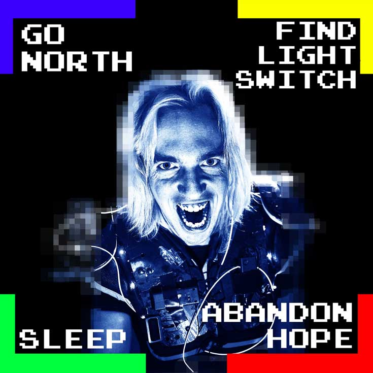

<!-- Main -->

<!-- One -->
<section id="one">
	

<!-- Content -->

Location: Main Auditorium
 
&pound; Ticket Required

The following shows are ticketed. Tickets can be purchased from the box office on the day, or reserve your seat in advance via the website (highly recommended - we've worked hard to keep these ticket prices low at just a few pounds each, so they're sure to go quickly!). Please note: children under the age of 12 must be accompanied by an adult.

		
	

	<h2>The Dark Room</h2>
	

	

		
		<a href="https://www.youtube.com/watch?v=gpAiW6uy_iY" target="_blank"><i class="icon alt fa-youtube" ></i> Watch on youtube</a>
	

	

		<blockquote>YOU AWAKE TO FIND YOURSELF IN A DARK ROOM!</blockquote>
		
The audience is trapped in a retro videogame with a sadistic end-of-level boss. Now either escape and win &pound;1000 - or be brutally murdered by the rest of the crowd! Will you:

		<ul class="nobullets">
			<li>A) Find the Light Switch?</li>
			<li>B) Go North?</li>
			<li>C) Abandon Hope? </li>
		</ul>
		
Filled with stand-up, appalling prizes and more audience chanting than you’d get at a protest - this is a gut-busting rock n’ roll experience for everyone who buys a ticket. 

		
There’s also a child-friendly(ish) version, which took home Best Kid’s Show at Leicester Comedy Festival 2018.

		<pre><code>★★★★★ ‘You must see this show’ – British Comedy Guide
★★★★★ ‘Utterly unique.’ - The Skinny</code></pre>

		<ul>
			<li>Show 1 - child-friendly, 13:00</li>
			<li>Show 2 (18+) - adults only, 16:30</li>
		</ul>
		<ul class="actions">
			<li><a href="https://www.exeterphoenix.org.uk/bookings/?webid=40069" class="button next" target="booking">Book Tickets (£3 each + £1 fee)</a></li>
		</ul>
	

	

	

	<h2>The Incredible Playable Show</h2>
	

	

		
		<a href="https://www.youtube.com/watch?v=H9hMqFkcH4o" target="_blank"><i class="icon alt fa-youtube" ></i> Watch on youtube</a>

	

	

		<h4>The Incredible Playable Show is an interactive video game comedy show where you, the audience, take to the stage!</h4>

		
Become human buttons, take on the Power Rangers, zap each other with barcode scanners, and play Pac-Man using inflatable toys. Or sit back, and watch your friends literally become cogs in a hilarious machine! 
		

		

		Created by game developer <a href="https://playable.show/" target="_blank">Alistair Aitcheson</a> the show has toured internationally and won the Jury Choice Award at
		IndieCade 2017.

		<ul>
			<li>Show 1 - 11:00</li>
			<li>Show 2 - 15:00</li>
		</ul>

		<ul class="actions">
			<li><a href="https://www.exeterphoenix.org.uk/bookings/?webid=40070" class="button next" target="booking">Book Tickets (£3 each + £1 fee)</a></li>
		</ul>
	

	

	Please direct all box office &amp; ticketing queries to Exeter Phoenix at <a href="https://www.exeterphoenix.org.uk/about-us/contact-2/" target="_blank">https://www.exeterphoenix.org.uk/about-us/contact-2/</a>
	

<!-- inner -->

</section>

