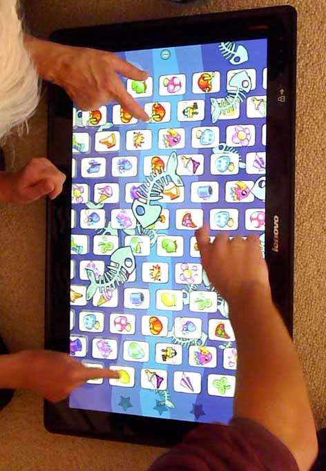

<!-- Main -->

<section id="one">
	

<!-- Content -->

Location: Q12 (popup), Queen Street dining
 
&pound; 2 all-day entry

Our popup gaming arcade is open in Queen Street dining. Your £2 wristband will get you access to a full day of retro and party games. Please note: children under the age of 12 must be accompanied by an adult.

<strong>Opening Times</strong>

<ul>
  <li>Fri 3rd July: 7pm - 10pm</li>
  <li>Sat 4th July: 10am - 10pm</li>
  <li>Sun 5th July: 10am - 6pm</li>
</ul>

</section>

<!-- Two -->
<section id="two" class="spotlights">
	<section>
		<i class="image">
			
		</i>
		

			

				<header class="major smallmargin">
					<h3>Joypad Arcade</h3>
				</header>
				
Our friends at <a href="http://www.joypadbar.co.uk/joypad-arcade" target="_blank">Joypad</a> are providing a selection of retro consoles to give over a dozen stations of gaming goodness. SNES, MegaDrive, GameCube, Dreamcast, N64, PlayStation - we've got them all!

				
We know everyone has their favourite consoles and games - prefer to break out the special moves in Street Fighter II over Streets of Rage? Rather hit the track with Mario Kart or Micro Machines? Sooner settle old scores with Goldeneye or Super Smash Bros.? Whatever your tastes, we should have you covered!

				<ul class="actions">
					<li><a href="http://www.joypadbar.co.uk" class="button small" target="_blank">Learn more</a></li>
				</ul>
			

		

	</section>
	
	<section>
		<i class="image">
		
		</i>
		

		

			<header class="major smallmargin">
				<h3>Food and Drink</h3>
			</header>
			
Our in-house bar area will be serving soft drinks and bottled/canned beers

			
Wristband wearers will also get 10% off their bill in participating Queen Street Dining restuarants!

		

		

	</section>

</section>

