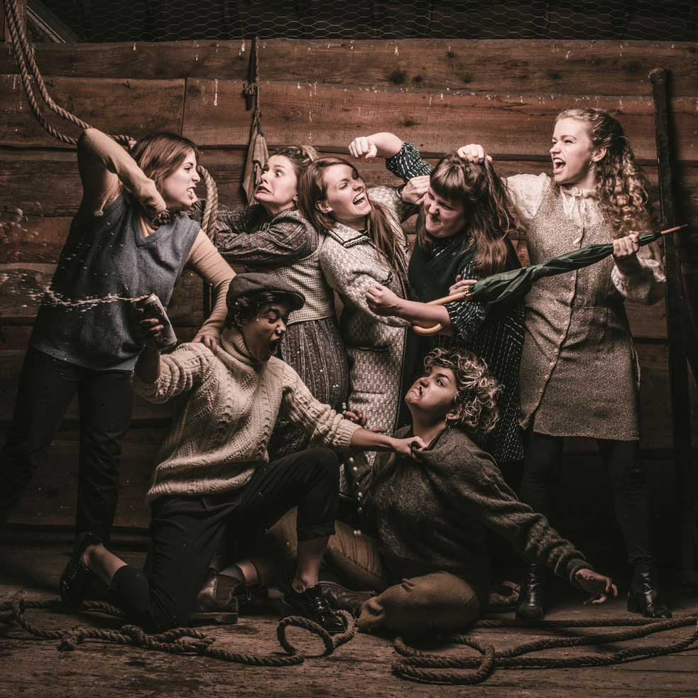
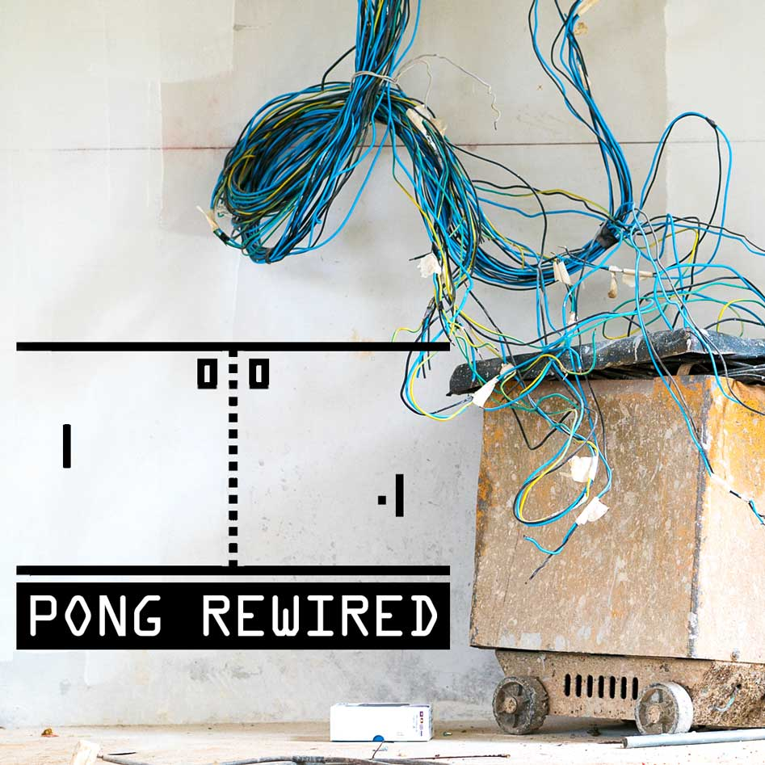
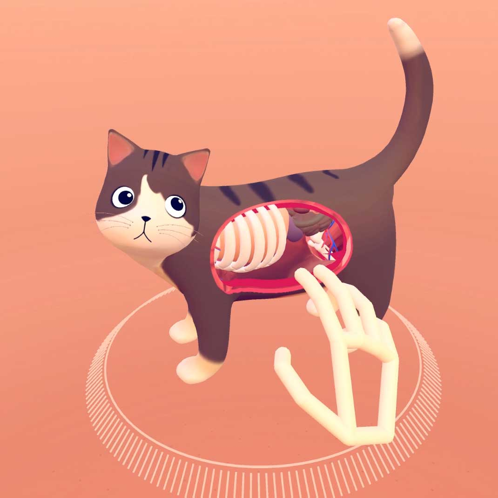

<!-- Main -->

<!-- One -->
<section id="one">
	

	<!-- Content -->

		
	

		<h2 id="rebellion">Rebellion Playground, hosted by Scratchworks Theatre Company</h2>
	

	

		
		
		<a href="https://www.facebook.com/ScratchworksTheatreCompany" target="_blank"><i class="fa fa-facebook"></i></a>
		<a href="https://twitter.com/ScratchworksC" target="_blank"><i class="fa fa-twitter"></i></a>
		Scratchworks Theatre Company 
	

	
	

	
Location: 1st Floor / Drama Studio
 
	
<i class="fa fa-warning"></i> Recommended for ages 16+

	
Step into the Rebellion Playground; a place for game changers, rule breakers, and balloon poppers!

	
This is a new interactive experience for anyone who wants to see change, big or small but doesn't know where to begin. Come and play, bend the rules, be provoked and start a discussion. 
The Playground will be inclusive for all, whether you would prefer to fully participate or to observe. The Scratchworks team are part game masters/ part revolution seekers, providing a series of provocations and tasks to the participants who have agency to accept, refuse or even revolt. 

	<ul>
		<li>Slot 1 : 11.00 - 12.30</li>
		<li>Slot 2 : 13.00 - 14.30</li>
		<li>Slot 3 : 15.00 - 16.30</li>
	</ul>
	
Spaces are limited to 18 people per slot. Due to the <em>rebellious</em> nature of the workshop, under 16s need to be accompanied by an adult.

	

	

	<ul class="actions">
		<li><button id="eventbrite-widget-modal-trigger-55020443628" class="button next">Reserve your slot</button>
		<noscript><a href="https://www.eventbrite.co.uk/e/gameplay-presents-rebellion-playground-registration-55020443628" rel="noopener noreferrer" class="button next" target="_blank">Reserve your slot</a></noscript>
		</li>
	</ul>
	

	

	

	<h2>PONG Rewired</h2>
	

	
	

	
Location: 1st Floor / Dance Studio

	
Come watch our glitched-out pong game self destruct the more it gets played!  Challenge your friends to a game using our crazy controllers, but do you dare to press the big red button?

	<h3>Maker Workshop</h3>
	
Join us in our workshop area (hosted by <a href="http://2timesdo.co.uk/" taget="_blank">2times.do</a>) to build your own controllers and switches to plug into the game (we're using the Microsoft Xbox Adaptive Controller to connect physical inputs to game joystick movements). We'll have soldering irons, wire, connectors and electrical components, so just bring your imagination!

	<h3>Developer Workshop</h3>
	
We'll have the full game sourcecode available if you want to make new builds of the game - just bring along your laptop and have the latest version of <a href="http://unity3d.com/" target="_blank">Unity</a> installed. Kris will be on hand to explain how the game code works and how you can build in your own features and ideas into the game.

	

	

		
	

			
	

	

		<h2 id="cat">Cat Explorer</h2>
	

	

		
	

	
	

	
Location: 1st Floor / Dance Studio
 
	
VR Experiment
 
	
VR interactions have the potential to be easier and more intuitive than with any other technology. Cat Explorer is a fun demo that points to the transformative potential of VR and natural interaction in fields as diverse as education, training, healthcare, and entertainment.

	
Instead of learning how to use a controller, Cat Explorer encourages you to learn through play and experimentation. With no instructions, previous experience or training, people can dive into the space and quickly understand what to do. Get exploring!

	<ul class="actions">
		<li><a href="https://gallery.leapmotion.com/cat-explorer/" class="button small" target="_blank">Learn More</a></li>
	</ul>
	
	

</section>

